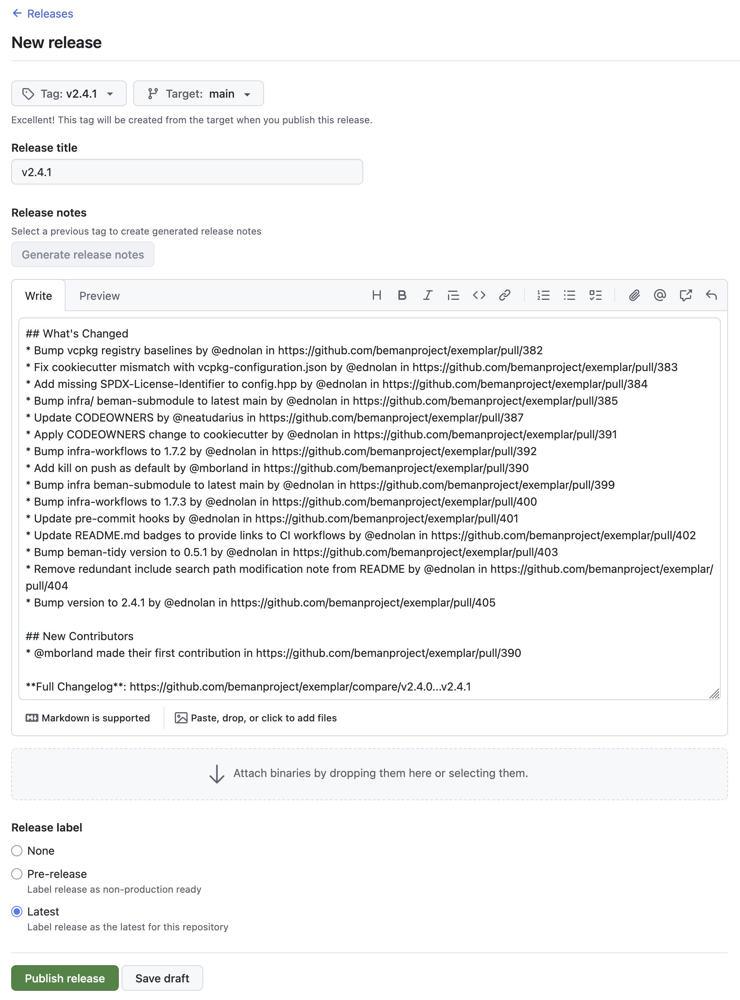

<!--
SPDX-License-Identifier: Apache-2.0 WITH LLVM-exception
-->

# The Beman Standard

This document specifies requirements and recommendations for Beman project libraries.
Its goal is to create consistency facilitating the evaluation of, and
contribution to Beman libraries.

## Introduction

### Core principles

This standard is driven by four core principles:

1. **[core.quality] Highest quality**. Standards track libraries impact
   countless engineers and, consequently, should be of the highest quality.
2. **[core.production_ready] Production-ready**. Production feedback
   necessitates reliable, well-documented software.
3. **[core.industry_standard] Industry standard technology**. Where there's
   industry consensus on best practices, we should take advantage. Innovation in
   tooling and style is not our purpose.
4. **[core.inclusive] Welcoming and inclusive community**. Broad, useful
   feedback requires an unobstructed path for using, reviewing, and
   contributing to Beman libraries. This principle encompasses ergonomics,
   cross-industry participation, and cultural accommodation.

### Changing this document

This is a living document that adapts to evolving best practices and community
needs. To make changes:

1. Create a [discourse topic](https://discourse.boost.org) detailing the change
   and how it aligns with the core principles.
2. After some community discussion, create a PR with the actual change on
   [GitHub](https://github.com/bemanproject/beman) and apply the *Beman leads* label.
   The PR should also link to the discourse topic.
3. Continue discussions on the PR and discourse topic.
4. Await a leads decision based on the community feedback.

Note: When making minor changes such as fixing typos, correcting grammar mistakes or improving clarity, some of the previous steps may be skipped - a PR can be directly created.

### Conventions

This standard consists of entries that include a lowercase, dot-separated
identifier for referencing.

With the exception of the core principles, these entries are either requirements or
recommendations.

- **Requirements** must be followed in order to conform to this standard. These entries
  are prefixed by "Requirement:".
- **Recommendations** should be followed in general, but specific circumstances
  may make this a less-than-ideal choice. Libraries not following a specific
  recommendation can still conform to this standard. These entries are prefixed
  by "Recommendation:".

## License

### **[license.approved]**

**Requirement**: All Beman libraries must be licensed under an approved license. These are:

1. [Apache License v2.0 with LLVM Exceptions](https://llvm.org/LICENSE.txt)
2. [Boost Software License 1.0](https://www.boost.org/LICENSE_1_0.txt)

### **[license.apache_llvm]**

**Recommendation**: A Beman library should be licensed
under the `Apache License v2.0 with LLVM Exceptions`
(first recommended license in [license.approved](#licenseapproved)).

Use the exact content from [beman/LICENSE](https://github.com/bemanproject/beman/blob/main/LICENSE)
into your library's `LICENSE` file.

### **[license.criteria]**

**Requirement**: All approved licenses must meet the following requirements:

1. Simple to read and understand.
2. Permission without fee to copy, use and modify the software for any
   use (commercial and non-commercial).
3. Requires that the license appears on all copies of the software source code.
4. Must not require that the license appears with executables or other binary
   uses of the library.
5. Must not require that the source code be available for execution or other
   binary uses of the library.

## General

### **[library.name]**

**Recommendation**: Beman libraries names begin with `beman.` followed by a `snake_case` short name. It should not contain a target C++ version.

Examples: `beman.smart_pointer` and `beman.sender_receiver`.

Bad examples: `smart_pointer` or `beman.smartpointer` or `beman.optional26`.

## REPOSITORY

### **[repository.name]**

**Requirement**: The repository must be named after the library name excluding the `beman.` prefix. It must not contain a target C++ version.

Examples: A `beman.smart_pointer` library's repository should be named `smart_pointer`. A `beman.optional` library's repository should be named `optional`.

Bad examples: `smartpointer` or `optional26`.

### **[repository.default_branch]**

**Requirement**: The repository must have `main` as default branch.

You can change the `default branch` via default repository settings menu - e.g., [exemplar/settings](https://github.com/bemanproject/exemplar/settings).

Here is snapshot of `default branch` settings in `exemplar` repository:


### **[repository.codeowners]**

**Requirement**: There must be a `.github/CODEOWNERS` file with a relevant set of codeowners. Please check [exemplar: CODEOWNERS](https://github.com/bemanproject/exemplar/blob/main/.github/CODEOWNERS).

### **[repository.code_review_rules]**

**Requirement**: There must be a default `Rulesets` configured for any Beman repository (library, infrastructre, documentation, etc.)

Use the following example:
* Go to your repository's settings - e.g., [exemplar/settings](https://github.com/bemanproject/exemplar/settings/).
* Go to `Code and automation` / `Rules` / `Rulesets` - e.g., [exemplar/settings/rulesets](https://github.com/bemanproject/exemplar/settings/rules/).
* You should have a single ruleset named `Default` - e.g., [exemplar/settings/rulesets/beman](https://github.com/bemanproject/exemplar/settings/rulesets/beman).
* Create (via `New ruleset` button) or update (click on `Default` ruleset) it to include the following rules:
  * Rulset Name: `Default`
  * Enforcement status: `Active`
  * Bypass list: Check `Organization admin` and `Repository admin`
  * Target branch: Check `Include default branch`
  * Go to `Rules` section
    * Check `Restrict deletions` and `Block force pushes`
    * Check `Require a pull request before merging` and configure it to have `Required approvals: 1`, `Require review from Code Owners` and `Allowed merge methods: Merge, Squash, Rebase`.
* Click `Create` to save the ruleset.

Here is a snapshot of `default branch` settings in `exemplar`:


### **[repository.disallow_git_submodules]**

**Recommendation**: The repository should not use git submodules. Check `cmake.use_find_package` for alternatives.

Known exceptions:
* [mpark/wg21: Framework for Writing C++ Committee Papers](https://github.com/mpark/wg21): A non-C++ submodule designed for drafting ISO C++ papers using LaTeX or Markdown.

## Release

### **[release.github]**

**Requirement**: All Beman libraries must be released using [GitHub Releases](https://docs.github.com/en/repositories/releasing-projects-on-github).

### **[release.version]**

**Recommendation**: The versioning of releases should adhere to the following guidance:

- The git tag of each version is prefixed with a 'v', e.g., `v1.2.3`

- Beman libraries not yet ready for the [review process](https://github.com/bemanproject/beman/blob/main/docs/beman_library_maturity_model.md#review-process-for-transitioning-a-library-to-production-ready) are version `0.y.z`

- Beman libraries that are ready for the [review process](https://github.com/bemanproject/beman/blob/main/docs/beman_library_maturity_model.md#review-process-for-transitioning-a-library-to-production-ready) but have not yet transitioned to "Production Ready" status are version `1.y.z`

- Beman libraries that have passed the [review process](https://github.com/bemanproject/beman/blob/main/docs/beman_library_maturity_model.md#review-process-for-transitioning-a-library-to-production-ready) and become "Production Ready" are version `x.y.z` where `x` >= 2.

- Except when it conflicts with the above guidance on the major version, Beman library version numbers should roughly observe [semantic versioning](https://semver.org/):

    - New releases that fix bugs without adding new functionality should bump the patch version

    - New releases that make changes or add new functionality without any API-breaking changes should bump the minor version

    - New releases that have API-breaking changes should bump the major version (unless it is `0` or `1`, as stated above).

        - These major version bumps should occur even if the library is in "Production ready. API may undergo changes" status.

        - If the library is in "Production ready. Stable API" status, then the major version shouldn't change (because the library shouldn't publish API-breaking changes).

### **[release.notes]**

**Recommendation**: Release should include:

1. A title that contains the release version, e.g., `v1.2.3`. (Check visual example for the field location.)

2. Description. (Check visual example for the field location.)

   2.1. A "What's changed" section listing all changes.

   2.2. A "New Contributors" section listing all first-time contributors.

   2.3. A "Full Changelog" link to the complete list of commits.

   2.4. A "Contributors" section listing all contributors to this release.

Note: All four of the above sections can be autogenerated by GitHub.

Note: If desired, maintainers may add additional detail to the release notes, such as
handwritten summaries of what changed, an explanation of the purpose of the release, and a
reorganization of the changelog specifying which changes are breaking changes, new
features, bug fixes, build system changes, or documentation updates.

Complete examples can be found in [https://github.com/bemanproject/exemplar/releases](https://github.com/bemanproject/exemplar/releases).

Here is a snapshot of notes for a particular release in `exemplar`:



### **[release.godbolt_trunk_version]**

**Recommendation**: A Beman library should have at least a trunk version deployed on godbolt with nightyclone mode activated. Check [tutorial: Compiler Explorer Deployment](https://github.com/bemanproject/beman/blob/main/guidelines/compiler-explorer-deployment.md).


## Top-level

The top-level of a Beman library repository must consist of `CMakeLists.txt`, `LICENSE`, and `README.md` files.

### **[toplevel.cmake]**

**Requirement**: There must be a `CMakeLists.txt` file at the repository's root that builds and tests (via. CTest) the library.

### **[toplevel.license]**

**Requirement**: There must be a `LICENSE` file at the
repository's root with the contents of an approved license that covers the
contents of the repository.

### **[toplevel.readme]**

**Requirement**: There must be a markdown-formatted
`README.md` file at the repository's root that describes the library, explains how
to build it, and links to further documentation.

## `README.md`

### **[readme.title]**

**Recommendation**: The `README.md` should begin with a level 1
header with the name of the library optionally followed with a ":" and short
description.

Examples:

```markdown
# beman.sender_receiver: Scalable Asychronous Program Building Blocks
```

### **[readme.badges]**

**Requirement**: Following the title, the `README.md` must have a badge list. Examples: library status (`[readme.library_status]`), CI status, code coverage, Compiler Explorer example.

Example:
```markdown
[](https://github.com/bemanproject/beman/blob/main/docs/beman_library_maturity_model.md#the-beman-library-maturity-model)
[](https://github.com/bemanproject/exemplar/actions/workflows/ci_tests.yml)
[](https://github.com/bemanproject/exemplar/actions/workflows/pre-commit-check.yml)
[](https://coveralls.io/github/bemanproject/exemplar?branch=main)

[](https://godbolt.org/z/4qEPK87va)
```

Use exactly one of the following entries for the library status badge.

For "Under development" (which should be used by new libraries), use:

```markdown
[](https://github.com/bemanproject/beman/blob/main/docs/beman_library_maturity_model.md#the-beman-library-maturity-model)
```

For "Production ready. API may undergo changes," use:

```markdown
[](https://github.com/bemanproject/beman/blob/main/docs/beman_library_maturity_model.md#the-beman-library-maturity-model)
```

For "Production ready. Stable API," use:

```markdown
[](https://github.com/bemanproject/beman/blob/main/docs/beman_library_maturity_model.md#the-beman-library-maturity-model)
```

For "Retired. No longer maintained or actively developed," use:

```markdown
[](https://github.com/bemanproject/beman/blob/main/docs/beman_library_maturity_model.md#the-beman-library-maturity-model)
```

Use exactly one of the following entries for the standard target status badge. 

For C++26, use:

```markdown

```

For C++29, use:

```markdown

```

If the library has been deployed onto Compiler Explorer, add this badge and replace the link with the link of the example code taken from Compiler Explorer:

```markdown
[](https://godbolt.org)
```

### **[readme.purpose]**

**Recommendation**: Following the badges list and a newline, the `README.md` should contain a one line summary describing the library's purpose.

### **[readme.implements]**

**Recommendation**: Following the purpose and a newline, the
`README.md` should indicate which papers the repository implements. Use the following style:

```markdown
**Implements**: [`std::optional<T&>` (P2988R5)](https://wg21.link/P2988R5) and
[Give *std::optional* Range Support (P3168R1)](https://wg21.link/P3168R1).
```

Note that specifying the revision number is optional.

### **[readme.library_status]**

**Requirement**: Following the implements section and a newline, the `README.md` must indicate the **current** library status with respect to the [Beman library maturity model](https://github.com/bemanproject/beman/blob/main/docs/beman_library_maturity_model.md). An extra badge must be added to the `README.md` to visually indicate the library status (check `[readme.badges]`). Note: The full library status history can be found in the GitHub release notes.

Use exactly one of the following entries for the status line:

```markdown
**Status**: [Under development and not yet ready for production use.](https://github.com/bemanproject/beman/blob/main/docs/beman_library_maturity_model.md#under-development-and-not-yet-ready-for-production-use)
```

or

```markdown
**Status**: [Production ready. API may undergo changes.](https://github.com/bemanproject/beman/blob/main/docs/beman_library_maturity_model.md#production-ready-api-may-undergo-changes)
```

or

```markdown
**Status**: [Production ready. Stable API.](https://github.com/bemanproject/beman/blob/main/docs/beman_library_maturity_model.md#production-ready-stable-api)
```

or

```markdown
**Status**: [Retired. No longer maintained or actively developed.](https://github.com/bemanproject/beman/blob/main/docs/beman_library_maturity_model.md#retired-no-longer-maintained-or-actively-developed)
```

### **[readme.license]**

**Requirement**: Following the library status line and a new line, the `README.md` must have a `LICENSE` section.

Use exactly the following format:
```markdown
## License

beman.exemplar is licensed under the Apache License v2.0 with LLVM Exceptions.

<!-- Other optional mentions go on this line ... >
```

or

```markdown
## License

beman.exemplar is licensed under the Boost Software License 1.0.

<!-- Other optional mentions go on this line ... >
```

or

```markdown
## License

beman.exemplar is licensed under the MIT License.

<!-- Other optional mentions go on this line ... >
```

or

```markdown
## License

beman.exemplar is licensed under the Boost Software License 1.0 and under the ... .

<!-- Other optional mentions go on this line ... >
```

## CMake

### **[cmake.default]**

**Recommendation**: The root `CMakeLists.txt` should build all targets by default (including dependency targets).

### **[cmake.use_find_package]**

**Recommendation**: The root `CMakeLists.txt` should fetch all dependency targets via [CMake `find_package`](https://cmake.org/cmake/help/latest/command/find_package.html).

Use the following style:

```CMake
find_package(<PackageName> [REQUIRED])
```

See `[cmake.skip_tests]` in this document for a working example or [exemplar/blob/main/CMakeLists.txt](https://github.com/bemanproject/exemplar/blob/main/CMakeLists.txt).


### **[cmake.project_name]**

**Recommendation**: The CMake project name should be identical to the beman library name.

### **[cmake.passive_projects]**

**Requirement**: CMake projects must not adjust user-specified compilation flags.

User-provided compilation flags, whether specified via presets, command-line
options, or toolchains, must not be modified by CMake projects. Therefore, CMake
projects may not set variables that impact compilation flags such as
`CMAKE_CXX_FLAGS` and `CMAKE_CXX_STANDARD`, as this would override user settings.

For common compiler/flag combinations, it is recommended to provide CMake presets
as a convenient alternative for users.

If specific compiler flags are essential for project functionality (e.g., C++
standard features), use utilities like `check_cxx_source_compiles` to detect
support and provide a helpful error message suggesting appropriate flags for the
user's compiler.

### **[cmake.library_name]**

**Recommendation**: The CMake library target's name should
be identical to the library name.

Examples:

```CMake
add_library(beman.smart_pointer)
#...
```

### **[cmake.library_alias]**

**Requirement**: The CMake code must create an alias of
the library target named `beman::<short_name>`. This target is intended for
external use.

Examples:

```CMake
add_library(beman::smart_pointer ALIAS beman.smart_pointer)
#...
```

### **[cmake.target_names]**

**Recommendation**: All targets, aside from the library target, should begin with a `<library_name>.` prefix

```CMake
add_executable(beman.smart_pointer.examples.basic)
#...
add_executable(beman.smart_pointer.tests.roundtrip)
#...
```

### **[cmake.passive_targets]**

**Requirement**: External targets must not modify compilation flags of dependents.

Therefore, `target_compile_features` (e.g., `cxx_std_20`) must not be used
because it modifies the compilation environment of dependent targets. Compiler
support for required features should be determined at CMake configuration time
using `check_cxx_source_compiles`.

Furthermore, `target_compile_definitions` with `PUBLIC` or `INTERFACE`
visibility must not be used, as these definitions are also propagated to
dependent targets. Preprocessor definitions intended for external use should be
generated into a `config.hpp` file at CMake configuration time. This
`config.hpp` should then be included by public headers.

### **[cmake.config]**

**Requirement**: At `install` time, a
`<library_name>-config.cmake` must be created which exports a
`beman::<short_name>` target.

### **[cmake.skip_tests]**

**Recommendation**: The root `CMakeLists.txt` should not build tests and their dependencies when `BEMAN_<short_name>_BUILD_TESTS` is set to `OFF` (see [CTest docs](https://cmake.org/cmake/help/latest/module/CTest.html) - similar to cmake's `BUILD_TESTING`). The option is prefixed with the project so that projects can compose. Turning on testing for the top level project should not turn on testing for dependencies. Since testing is part of the normal development workflow it is appropriate to set the option on by default for the top level project.

Use the following style:

```CMake
# File: <repo>/CMakeLists.txt
# ...
option(
    BEMAN_<short_name>_BUILD_TESTS
    "Enable building tests and test infrastructure. Default: ${PROJECT_IS_TOP_LEVEL}. Values: { ON, OFF }."
    ${PROJECT_IS_TOP_LEVEL}
)
# ...
if(BEMAN_<short_name>_BUILD_TESTS)
  add_subdirectory(tests)
endif()
```

The `CMakeLists.txt` in the test directory can declare any test-only dependendencies
that are required. For instance:


```CMake
# File: <repo>/tests/CMakeLists.txt
# ...
find_package(GoogleTest REQUIRED)

add_executable(myrepo-tests)
# ...
gtest_discover_tests(myrepo-tests)
```

### **[cmake.skip_examples]**

**Recommendation**: The root `CMakeLists.txt` should not build examples and their dependencies when `BEMAN_<short_name>_BUILD_EXAMPLES` is set to `OFF`. The option is prefixed with the project so that projects can compose. Turning on examples for the top level project should not turn on examples for dependencies.

Use the following style:

```CMake
# <repo>/CMakeLists.txt
# ...
option(
    BEMAN_<short_name>_BUILD_EXAMPLES
    "Enable building examples. Default: ${PROJECT_IS_TOP_LEVEL}. Values: { ON, OFF }."
    ${PROJECT_IS_TOP_LEVEL}
)

# add actual code to be build here
...

# ...
if(BEMAN_<short_name>_BUILD_EXAMPLES)
  add_subdirectory(examples)
endif()
```

### **[cmake.avoid_passthroughs]**

**Recommendation**: Avoid `CMakeLists.txt` files consisting of a single `add_subdirectory` call.

In other words prefer,

```CMake
# <repo>/CMakeLists.txt
# ...
add_subdirectory(src/beman/optional)
```

to,

```CMake
# <repo>/CMakeLists.txt
# ...
add_subdirectory(src) # Don't do this

# <repo>/src/CMakeLists.txt
add_subdirectory(beman) # Don't do this

# <repo>/src/beman/CMakeLists.txt
add_subdirectory(optional) # Don't do this
```

###  **[cmake.implicit_defaults]**

**Recommendation**: Where CMake commands have reasonable default values, and the project does not intend to change those values, the parameters should be left implicitly defaulted rather than enumerated in the command.

Example:

```CMake
install(
    TARGETS beman.project
    EXPORT beman.project-targets
    FILE_SET HEADERS
)
```

Bad Example:

```CMake
install(
    TARGETS beman.project
    EXPORT beman.project-targets
    DESTINATION ${CMAKE_INSTALL_LIBDIR}
    RUNTIME
        DESTINATION ${CMAKE_INSTALL_BINDIR}
    FILE_SET HEADERS
        DESTINATION ${CMAKE_INSTALL_INCLUDEDIR}
)
```

### **[cmake.no_single_use_vars]**

**Recommendation**: Avoid using `set()` to create variables that are only used once. Prefer using the value(s) directly in such cases.

Example:

```CMake
target_sources(beman.project
    PRIVATE
        a.cpp
        b.cpp
        c.cpp
)
```

Bad Example:

```CMake
set(SOURCES
    a.cpp
    b.cpp
    c.cpp
)

# ...

target_sources(beman.project PRIVATE ${SOURCES})
```

## Directory layout

### **[directory.interface_headers]**

**Requirement**: Header files that are part of the public interface must reside within the `include/beman/<short_name>/` directory.

Examples:

```shell
include
└── beman
    └── exemplar
        └── identity.hpp
        └── ...
        └── ...
```

### **[directory.implementation_headers]**

**Requirement**: Header files residing within `include/beman/<short_name>/` that are not part of the public interface
must either begin with `detail_` or reside within a subdirectory of
`include/beman/<short_name>/` called `detail` or begins with `detail_`.

Examples:

```shell
include
└── beman
    └── optional
        ├── detail                           # Private implementation subdirectory.
        │   ├── iterator.hpp
        │   └── stl_interfaces
        │       ├── config.hpp
        │       ├── fwd.hpp
        │       └── iterator_interface.hpp
        └── optional.hpp                     # Public interface.
```

### **[directory.sources]**

**Requirement**: If present, sources and headers not part of the
public interface should reside in the top-level `src/` directory, and should use
the same structure from `include/` - e.g., `src/beman/<short_name>/`. Check `cmake.avoid_passthroughs`.

Examples:

```shell
src
└── beman
    └── exemplar
        ├── CMakeLists.txt
        └── identity.cpp

src
└── beman
    └── optional
        ├── CMakeLists.txt
        ├── detail
        │   └── iterator.cpp
        └── optional.cpp
```

### **[directory.tests]**

**Requirement**: All test files must reside within the top-level `tests/`
directory, and should use the same structure from `include/`. If multiple test types are present,
subdirectories can be made (e.g., unit tests, performance etc). Each project must have at least
one relevant test.

Examples:

```shell
tests
└── beman
    └── exemplar
        └── identity.test.cpp

tests
└── beman
    └── optional
        ├── CMakeLists.txt
        ├── detail
        │   └── iterator.test.cpp
        ├── optional.test.cpp
        ├── optional_constexpr.test.cpp
        ├── optional_monadic.test.cpp
        ├── optional_range_support.test.cpp
        ├── test_types.cpp
        ├── test_types.hpp
        ├── test_utilities.cpp
        └── test_utilities.hpp
```

### **[directory.examples]**

**Requirement**: All example files must reside within the top-level `examples/`
directory. Each project must have at least one relevant example.

Examples:

```shell
examples
├── CMakeLists.txt
├── identity_as_default_projection.cpp
└── identity_direct_usage.cpp
```

### **[directory.docs]**

**Requirement**: If present, all documentation files, except the root `README.md` and `CONTRIBUTING.md`, must reside within the top-level `docs/` directory. If multiple docs types are present, subdirectories can be made (e.g., dev, public/private etc).

Examples:

```shell
docs
├── debug
│   └── ci.md
├── dev
│   └── lint.md
├── local.md
└── optional.md
```

### **[directory.papers]**

**Requirement**: If present, all paper related files (e.g., WIP LaTeX/Markdown projects for ISO Standardization), must reside within the top-level `papers/` directory.

Examples:

```shell
papers
└── P2988
    ├── Makefile
    ├── README.md
    ├── abstract.bst
    ...
```

## File layout

### **[file.names]**

**Recommendation**: Source code and header should use the `snake_case` naming convention (similar to `LIBRARY.NAMES`).

Examples: `identity.hpp`, `identity.cpp`, `iterator_interface.hpp` or `optional_range_support.test.cpp`.

### **[file.test_names]**

**Requirement**: Test source code files must use the `*.test.cpp` naming convention.

Examples: `identity.test.cpp`, `optional_ref.test.cpp` or `optional_range_support.test.cpp`.

### **[file.license_id]**

**Requirement**: The [SPDX license identifier](https://spdx.dev/learn/handling-license-info/) must be added within the first 25 lines in all files which can contain a comment
(e.g., C++, scripts, CMake/Makefile, YAML/YML, JASON, XML, HTML, LaTeX, Dockerfile etc).

Examples:

* C++ files shall use the following form:

```C++
// SPDX-License-Identifier: <SPDX License Expression>
```

* CMake files and scripts shall use the following form:

```CMake
# SPDX-License-Identifier: <SPDX License Expression>
```

* Markdown files will use a comment following the title:

```markdown
# Title

<!--
SPDX-License-Identifier: <SPDX License Expression>
-->
```

### **[file.copyright]**

**Recommendation**: Source code files should NOT include a copyright notice following the SPDX license identifier.

## C++

### **[cpp.namespace]**

**Recommendation**: Headers in `include/beman/<short_name>/` should export
entities in the `beman::<short_name>` namespace.

### **[cpp.no_flag_forking]**

**Requirement**: C++ preprocessing must produce identical output regardless of compiler flags.

Therefore, feature test macros such as `__cpp_explicit_this_parameter` should
not be used directly. 

**Recommendation**: Feature-dependent code should create `#define`s in generated headers based on CMake options, with a fallback for users who just vendor the include/ directory.

Instead use the following approach for feature-dependent
code generation:

1. Create a CMake `option` (e.g. `BEMAN_EXEMPLAR_USE_FEATURE_QUUX`).
2. Depending on the option, you may want to implement a check for its availability at
   CMake time, using, for example, `check_cxx_source_compiles`, and set the option's
   default value based on the result.
3. Generate a `config_generated.hpp` with a `#define` macro set to the selected option.
4. Create a `config.hpp` file that wraps `config_generated.hpp` with the following logic,
   providing fallback defaults for users who vendor the include/ directory:

```cpp
#if !defined(__has_include) ||                                                 \
    __has_include(<beman/exemplar/config_generated.hpp>)
#include <beman/exemplar/config_generated.hpp>
#else
#define BEMAN_EXEMPLAR_USE_FEATURE_QUUX() 1
#endif
```

5. Include `config.hpp` in your headers, and use the resulting macro instead of the
   feature test macro.

See
[beman.iterator_interface](https://github.com/bemanproject/iterator_interface/blob/473a9400fd51b9a4e3372a716ac1b501ec0297ad/CMakeLists.txt#L21)
for an example.

### **[cpp.extension_identifiers]**

**Recommendation**: For functionality that is not being recommended for standardization, but is an extension provided by the library, its identifiers should be prefixed with `ext_`.
